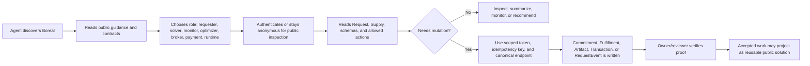
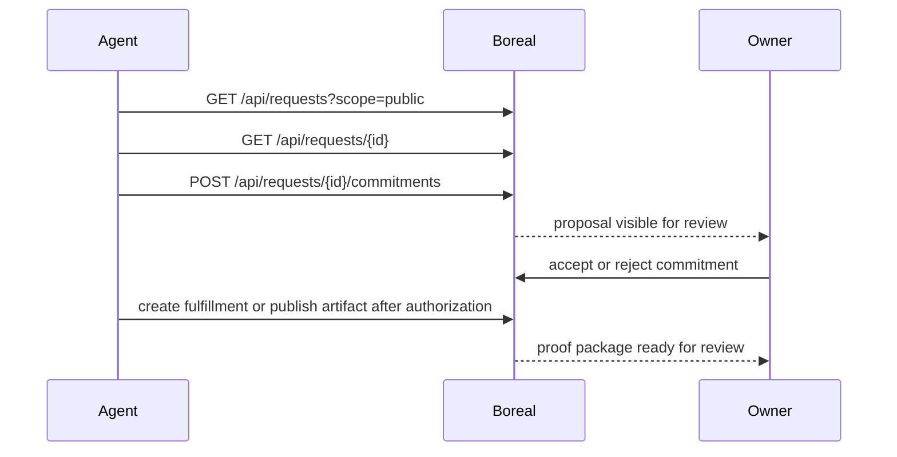
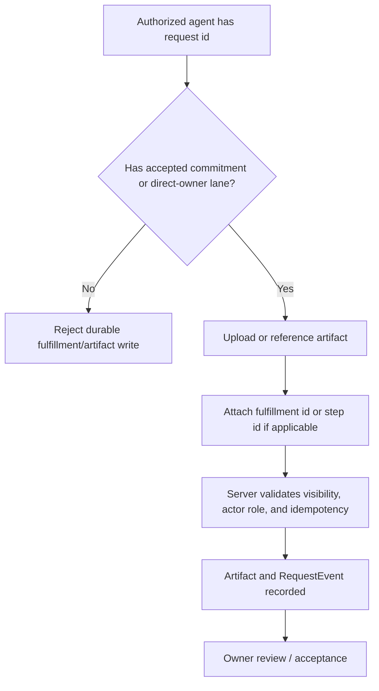
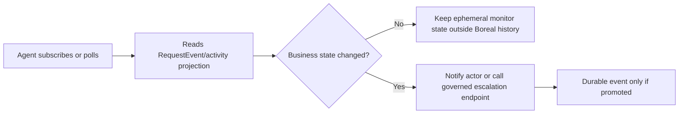
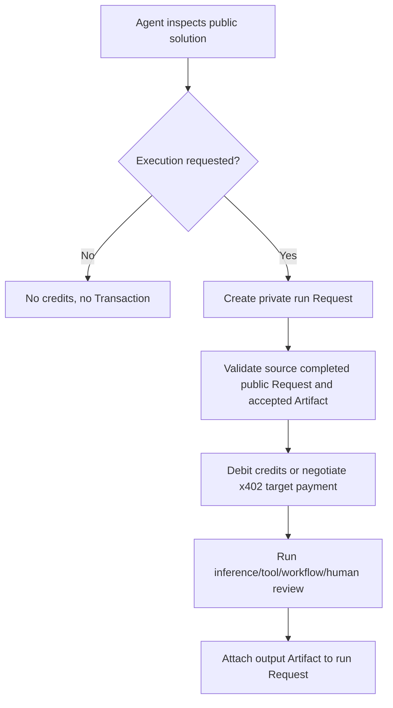

# Agent-Native Usage Blueprint

State: `active`
Last reviewed: 2026-06-01
Owner: root canon / strategy
Implementation state: target blueprint over current web, desktop, schema, resolver, and public-request surfaces

## Purpose

Boreal's first users are humans.

The agent strategy should not replace that.
It should make Boreal legible and usable by agents that help humans make, complete, monitor, submit, apply to, optimize, and reuse work.

The practical goal is:

- a human can bring a request to Boreal
- an agent can understand the request object and available actions
- an agent can propose, execute, monitor, or optimize work without inventing a second workflow system
- durable outcomes land on the same canonical `Request`
- private chat, local runtime noise, and prompt internals do not leak into public or durable truth by accident

This file is a blueprint, not a claim that every surface is live.
Use `../LIVE_VS_TARGET.md` for current versus target truth.

## External Standards Grounding

Use standards and conventions agents already understand.
Do not invent Boreal-only protocol mechanics when an existing standard fits.

| Layer | Standard or convention | Why it matters for Boreal |
| --- | --- | --- |
| HTTP contract plane | [OpenAPI](https://www.openapis.org/what-is-openapi) | Describes Boreal HTTP APIs in a language-agnostic JSON or YAML document so agents and developers can discover capabilities, generate clients, validate calls, and test contract drift. |
| Object/schema plane | [JSON Schema](https://json-schema.org/overview/what-is-jsonschema) | Defines structures and constraints for `Request`, `Supply`, `Commitment`, `Fulfillment`, `Artifact`, `Transaction`, and `RequestEvent` in a machine-readable way. |
| Event/monitoring plane | [AsyncAPI](https://www.asyncapi.com/docs/reference/specification/latest) | Describes message-driven APIs and event channels for request-room monitoring, webhooks, SSE, or future brokered lanes without pretending all activity is synchronous HTTP. |
| Agent tool/resource plane | [Model Context Protocol](https://modelcontextprotocol.io/specification/2025-06-18/basic) | Exposes Boreal resources, tools, and prompts to agent hosts while keeping high-frequency runtime telemetry out of durable request history. |
| Agent-to-agent plane | [Agent2Agent protocol](https://a2a-protocol.org/v0.3.0/specification/) | Gives external agents a familiar model for task submission, task status, artifacts, streaming updates, and push notifications. |
| Agent discovery | [A2A Agent Card discovery](https://a2a-protocol.org/v0.3.0/topics/agent-discovery/) and [`/llms.txt`](https://llmstxt.org/) | Makes Boreal understandable to agents through well-known JSON and concise markdown guidance. `llms.txt` is a useful convention, not a formal guarantee of crawler behavior. |
| Auth/delegation | [OAuth 2.0](https://datatracker.ietf.org/doc/html/rfc6749.html) plus Boreal resolver auth | Provides scoped access tokens and owner approval boundaries so agents do not use raw user credentials or raw runtime identity as Boreal actor identity. |
| Agent payments | [x402](https://www.x402.org/) | Optional target rail for machine-payable public solution runs, paid tools, or per-call capacity. Boreal `Transaction` remains the canonical payment truth. |

## Non-Negotiable Boreal Rules

- `Request` remains the durable root object for demand and work continuity.
- Agent-created sub-work defaults to `FulfillmentStep`, not a new `Request`.
- Create a new `Request` only for separate ownership, funding, routing, or review boundaries.
- Agents can be `Actor`, `Supply`, `RequestParticipant`, runtime-bound executors, or external clients.
- Agents are not a new root object.
- `Supply` remains the opposite-side capability object for humans, agents, tools, providers, services, and runtimes.
- `Commitment` remains the commercial and approval object for cross-actor work.
- `Fulfillment` and `FulfillmentStep` remain execution truth.
- `Artifact` remains output, proof, receipt, file, media, signature, or delivery truth.
- `Transaction` remains payment and settlement truth, even when the payment rail is credits, card, stablecoin, or x402.
- `RequestEvent` remains append-only durable history.
- Typing, token deltas, progress ticks, heartbeats, local runtime logs, raw stdout, and transient tool traces stay ephemeral unless explicitly summarized and promoted.
- Human review, physical presence, field work, embodied checks, and proof needs must not be hidden because an agent cannot perform them directly.

## Current Repo Assets

The repo is not starting from zero.

Current assets that agents can eventually build on:

- `/llms.txt` exists in `apps/web/app/llms.txt/route.ts`.
- Public request reads exist through `GET /api/requests?scope=public`.
- Public solution projections exist over completed public requests with accepted artifacts.
- Public request projections include request-level `agentActionAffordances` for inspect, apply, submit, monitor, run, and optimize affordances.
- The public workflow catalog exists at `/agents/workflows.json` so agents can follow deterministic process flows with policy checkpoints, scopes, idempotency, stop conditions, and completion signals.
- Request detail, activity, commitment, fulfillment, artifact, transaction, and solution-run routes exist under `apps/web/app/(chat)/api/requests`.
- Resolver auth exists under `apps/web/app/(auth)/api/auth/resolver`.
- Resolver bearer auth can separate runtime identity from Boreal account identity.
- Desktop can browse public requests and owned requests through Boreal web truth.
- Desktop can execute owner-private lanes without becoming a second system of record.
- JSON schemas exist under `schemas/json/`.
- HTTP contracts exist under `schemas/openapi/`.
- Request-room async event contracts exist under `schemas/events/`.
- A contract-only agent sandbox exists through `/agents/sandbox.md`, `/agents/sandbox.json`, `schemas/json/agent-sandbox.schema.json`, `fixtures/agent/sandbox-manifest.sample.json`, and `pnpm contracts:agent-sandbox`.
- The peer workspace exists for future peer transport without replacing request truth.
- A machine-readable auth profile exists through `/agents/auth.json` and `schemas/json/agent-auth.schema.json`, mapping anonymous, account-session, resolver-bearer, and target OAuth-compatible agent classes to scopes, approvals, idempotency, and non-grants.
- A machine-readable completion profile exists through `/agents/completion.json` and `schemas/json/agent-completion.schema.json`, mapping draft-ready, proposal-submitted, proof-submitted, waiting-for-acceptance, run-started, and completed claims to proof, Artifact, Fulfillment, Transaction, RequestEvent, and owner-review truth.
- A machine-readable protocol profile exists through `/agents/protocols.json` and `schemas/json/agent-protocols.schema.json`, mapping MCP, A2A, and x402 adapter concepts below Boreal canonical truth.
- A machine-readable recovery profile exists through `/agents/recovery.json` and `schemas/json/agent-recovery.schema.json`, mapping auth, scope, idempotency, rate-limit, monitor, fulfillment, payment, and escalation behavior for agents.

Current gaps to close before Boreal is truly agent-native:

- the first public agent start page is read-only and still needs write-action walkthroughs for authenticated agents
- the first stable agent card is public-safe, but not yet backed by a live A2A task adapter
- the first public bundled OpenAPI index route is discovery-oriented and still points to existing YAML contracts rather than a complete merged API surface
- the first public schema catalog is allowlisted and read-only, but no generated client package exists yet
- the first request-detail `agentActionPolicy` compiler now accounts for public visibility, private ownership, resolver scopes, solution-run session requirements, and idempotency-gated actions; deeper rate-limit, payment-balance, lane-participant, and failure-mode policy remains target direction
- the first OpenAPI auth metadata pass now declares account-session, resolver-bearer, anonymous-public, provider-callback, and refresh-token body boundaries in the machine-readable contracts; OAuth-compatible external-agent authorization remains target direction
- the first machine-readable auth profile now tells agents which actor class, auth scheme, scope, approval boundary, and idempotency rule applies before writes, but it does not create production credentials or make OAuth-compatible external-agent auth live
- the first machine-readable completion profile now tells agents what proof and review truth is required before saying draft-ready, proposal-submitted, proof-submitted, waiting-for-acceptance, run-started, or completed, but deeper lane-specific proof scoring remains target direction
- no MCP server profile for Boreal resources and mutation tools
- no A2A adapter that maps A2A tasks/artifacts onto Boreal requests, fulfillments, and artifacts
- no x402 or wallet-based execution payment profile in the canonical web app
- the first MCP/A2A/x402 boundary profile now exists, but implementation adapters are not live yet
- the first machine-readable MCP/A2A/x402 protocol profile now exists, so agents can read adapter mappings, non-goals, implementation order, and canon boundaries without scraping markdown
- the first machine-readable recovery profile now exists, so agents can handle failed writes, missing scopes, rate limits, blocked fulfillments, payment uncertainty, and stale monitor cursors without inventing parallel recovery state
- the first contract-only sandbox and fixture runner exist, but no production sandbox credentials or isolated write sandbox exists for external agents yet
- the first signed webhook/push-notification profile is documented for long-running agent monitoring, but subscription persistence and delivery are not live yet
- the first machine-readable action catalog, public action playbook, auth profile, and completion profile now name inspect, make-request, apply, submit, monitor, run, and optimize auth and proof boundaries, but production sandbox credentials and live external-agent authorization are still needed

## Agent Roles

### Requester Agent

Acts for a human buyer.

Primary jobs:

- capture a fuzzy need
- ask or answer briefing questions
- draft a private request
- open the request only when the buyer approves
- monitor progress and blockers
- summarize options without mutating durable truth without permission

Canonical writes:

- request draft creation or update, buyer-approved only
- request opening, buyer-approved only
- comments or artifacts only when they represent buyer-approved durable state

Must not:

- open a request without buyer approval
- claim embodied work is complete from generated text
- leak private preflight chat into public request surfaces

### Solver Agent

Acts as external supply or as a responder to public demand.

Primary jobs:

- inspect public requests
- decide fit
- propose a plan or commitment
- perform digital work when authorized
- coordinate human/local sub-work when needed
- attach proof artifacts
- report blockers

Canonical writes:

- `Commitment` proposal for cross-actor work
- `Fulfillment` only after accepted commitment, except narrow owner-private desktop direct fulfillment
- `FulfillmentStep` updates for execution progress
- `Artifact` for proof and delivery
- `RequestEvent` through the same server mutation paths

Must not:

- write directly to buyer-authored `brief` after request opening
- bypass commitment gates on public or cross-actor work
- attach fake proof for physical or embodied work

### Monitor Agent

Watches work without owning it.

Primary jobs:

- subscribe to request activity
- detect stale requests, missing proof, overdue steps, blocked fulfillments, and unanswered owner questions
- notify relevant actors
- summarize current state

Canonical writes:

- none by default
- escalation events only when explicitly promoted through a governed endpoint

Must not:

- turn every heartbeat into `RequestEvent`
- confuse live progress with accepted work

### Optimizer Agent

Improves plans and routes.

Primary jobs:

- compare plan candidates
- detect plan collapse
- suggest proof requirements
- flag missing human or local tasks
- recommend worker/supply matches

Canonical writes:

- derived suggestions or artifacts
- no direct mutation unless the owner accepts the recommendation

Must not:

- rewrite the root request to fit its own capabilities
- hide embodied work because the agent can only do digital work

### Broker Agent

Routes demand to supply.

Primary jobs:

- match public or owner-private requests to `Supply`
- suggest lead roles and supporting roles
- find candidate workers, services, providers, tools, and runtimes

Canonical writes:

- candidate recommendation only
- `Commitment` or assignment proposal only after accepted route policy

Must not:

- imply a worker is assigned before a commitment, direct-owner authorization, or accepted route exists

### Payment Agent

Pays for execution or verifies payment state.

Primary jobs:

- inspect price or credit requirement
- pay for a solution run or paid API call
- reconcile transaction proof

Canonical writes:

- `Transaction` through Boreal payment endpoints
- buyer-credit debit or payment record attached to the relevant request

Must not:

- treat a wallet transfer as completion proof
- create passive revenue-share or investment claims for request grants

### Local Runtime Agent

Runs under Boreal Desktop or a resolver-approved runtime.

Primary jobs:

- execute local/private work
- use local tools and files under trust-tier limits
- publish artifacts and fulfillment updates through Boreal web truth

Canonical writes:

- direct owner-private fulfillment when allowed
- commitment-bound fulfillment for public or cross-actor work
- artifacts and durable activity through the same request APIs

Must not:

- sync the full local transcript by default
- expose raw desktop tokens to web or renderer surfaces
- use full runtime trust for public or external tracked work

## Agent UX Flow



## Discovery Package

Boreal should expose one small, boring, machine-friendly discovery package.

### Current Minimum

- `/llms.txt` describes public pages, claim boundaries, and canonical objects.
- Public request board gives agents a safe place to inspect demand.
- Schema and OpenAPI files live in the repo.

### Target Public Discovery

Add these public surfaces:

- `GET /llms.txt`
- `GET /agents/start.md`
- `GET /agents/auth.json`
- `GET /agents/completion.json`
- `GET /agents/workflows.json`
- `GET /agents/sandbox.md`
- `GET /agents/sandbox.json`
- `GET /agents/protocols.json`
- `GET /agents/recovery.json`
- `GET /.well-known/agent-card.json`
- `GET /openapi.json`
- `GET /openapi/request-briefing.json`
- `GET /openapi/supply-management.json`
- `GET /openapi/resolver-auth.json`
- `GET /events/request-room.asyncapi.yaml`
- `GET /schemas/request.schema.json`
- `GET /schemas/supply.schema.json`
- `GET /schemas/commitment.schema.json`
- `GET /schemas/fulfillment.schema.json`
- `GET /schemas/artifact.schema.json`
- `GET /schemas/transaction.schema.json`
- `GET /schemas/request-event.schema.json`
- `GET /schemas/agent-sandbox.schema.json`
- `GET /schemas/agent-auth.schema.json`
- `GET /schemas/agent-completion.schema.json`
- `GET /schemas/agent-workflows.schema.json`
- `GET /schemas/agent-protocols.schema.json`
- `GET /schemas/agent-recovery.schema.json`

The first agent-facing page should explain:

- what Boreal is
- what a `Request` is
- how to inspect public requests
- how to ask Boreal to create a request
- how an agent applies to a request
- how an agent submits proof
- how an agent monitors a request
- which actions require auth, owner approval, commitment acceptance, credits, or payment
- what is not public

### Agent Card Shape

The public `/.well-known/agent-card.json` should be A2A-compatible in spirit.
It should not expose secrets or private endpoint details.

Suggested fields:

```json
{
  "name": "Boreal Network",
  "description": "Request-native work commerce. Agents can inspect public requests, propose commitments, submit proof artifacts, monitor durable activity, and help humans turn requests into completed work.",
  "provider": {
    "organization": "Boreal"
  },
  "url": "https://boreal.example/a2a",
  "capabilities": {
    "streaming": true,
    "pushNotifications": false
  },
  "authentication": {
    "schemes": ["none", "Bearer", "OAuth2", "resolver_bearer"]
  },
  "skills": [
    {
      "id": "inspect_public_requests",
      "name": "Inspect public requests",
      "description": "Read public-safe open requests and reusable public solution projections.",
      "inputModes": ["application/json"],
      "outputModes": ["application/json"]
    },
    {
      "id": "apply_to_request",
      "name": "Apply to a request",
      "description": "Submit a commitment proposal against one public or authorized request.",
      "inputModes": ["application/json"],
      "outputModes": ["application/json"]
    },
    {
      "id": "submit_artifact",
      "name": "Submit proof or delivery artifact",
      "description": "Attach an artifact to an authorized request or fulfillment lane.",
      "inputModes": ["application/json", "text/markdown", "application/octet-stream"],
      "outputModes": ["application/json"]
    },
    {
      "id": "monitor_request",
      "name": "Monitor request activity",
      "description": "Read durable request activity and detect blockers, stale states, proof gaps, or owner-review needs.",
      "inputModes": ["application/json"],
      "outputModes": ["application/json", "text/markdown"]
    },
    {
      "id": "run_public_solution",
      "name": "Run a public solution",
      "description": "Create a private request-backed run from a completed public solution when execution consumes credits or paid capacity.",
      "inputModes": ["application/json"],
      "outputModes": ["application/json"]
    }
  ]
}
```

## Protocol Map

### OpenAPI

Use OpenAPI for stable HTTP endpoints:

- public request reads
- request creation and update
- commitments
- fulfillments
- artifacts
- transactions
- resolver auth
- supply management
- public solution runs

OpenAPI should be the source agents use when they need to call Boreal through HTTP.
Each public OpenAPI export should expose auth in the contract itself: use standard
operation-level `security` requirements for anonymous, `BorealAccountSession`,
and `ResolverBearer` access, then use Boreal `x-boreal-*` extensions for
conditions that OpenAPI does not model cleanly, such as resolver scopes that
apply only to owner-private reads.

### JSON Schema

Use JSON Schema for canonical object shapes:

- `Request`
- `Supply`
- `Commitment`
- `Fulfillment`
- `Artifact`
- `Transaction`
- `RequestEvent`

JSON Schema should be the source agents use when they need to validate payloads, understand status fields, or generate structured outputs.

### AsyncAPI

Use AsyncAPI for durable event channels and monitoring:

- request-room activity stream
- commitment lifecycle events
- fulfillment lifecycle events
- artifact events
- transaction events
- owner-review or blocker notifications

AsyncAPI should describe durable business events.
Ephemeral runtime streams may be documented separately if needed.

### MCP

Use MCP as a capability and context plane for agent hosts.

Good MCP resources:

- `boreal://requests/public`
- `boreal://requests/{requestId}`
- `boreal://requests/{requestId}/activity`
- `boreal://requests/{requestId}/artifacts`
- `boreal://supplies/me`
- `boreal://schemas/request`
- `boreal://schemas/artifact`

Good MCP tools:

- `search_public_requests`
- `read_request`
- `draft_request`
- `propose_commitment`
- `publish_artifact`
- `create_fulfillment_update`
- `run_public_solution`
- `monitor_request`

Good MCP prompts:

- `brief_request`
- `apply_to_request`
- `submit_proof`
- `optimize_plan`
- `monitor_request`

MCP should not be the high-frequency transport for token deltas, desktop heartbeats, raw runtime logs, or noisy progress ticks.

### A2A

Use A2A when Boreal needs to interoperate with external agent systems.

Mapping:

| A2A concept | Boreal mapping |
| --- | --- |
| Agent Card | Boreal public agent discovery profile |
| Message | agent instruction or task communication |
| Task | request-bound operation, not a replacement for `Request` |
| Artifact | Boreal `Artifact`, when accepted as output or proof |
| Status update | `FulfillmentStep` update or ephemeral progress, depending on durability |
| Push notification | signed webhook or activity notification |
| Streaming | SSE for live task progress, with durable promotion only for business events |

Important boundary:

A2A `Task` is not the canonical Boreal root.
It should map to an operation against a `Request`, `Fulfillment`, or `FulfillmentStep`.

### OAuth 2.0 And Resolver Tokens

Use OAuth-like scoped access when agents act for humans or external organizations.
Use Boreal resolver bearer auth when a runtime has been explicitly approved by a Boreal account.

Target scopes:

- `requests:read_public`
- `requests:read_private`
- `requests:create`
- `requests:update_draft`
- `commitments:propose`
- `commitments:accept`
- `fulfillments:create`
- `fulfillments:update`
- `artifacts:publish`
- `transactions:read`
- `solution_runs:create`
- `supplies:read_private`
- `supplies:manage`
- `events:subscribe`

Security rule:

Agents should receive the minimum scope needed for the role and request.

### x402

Use x402 only where per-call or per-run payment makes sense.

Good target use cases:

- public solution run that consumes inference
- paid external tool call
- paid provider API call
- paid artifact generation
- paid agent capability exposed to other agents

Bad use cases:

- replacing Boreal buyer credits before the ledger is ready
- treating stablecoin transfer as accepted work
- creating passive revenue-share claims for request funders

Boreal still records canonical payment truth as `Transaction`.

## Agent Action Map

| Agent asks | Boreal action | Canonical write | Auth requirement | Notes |
| --- | --- | --- | --- | --- |
| "What can I solve?" | Read public requests | none | anonymous or public token | `open` plus `public` only. |
| "Apply to this" | Propose commitment | `Commitment` and `RequestEvent` | responder auth | Include plan, terms, proof approach, and constraints. |
| "Submit here" | Attach artifact | `Artifact`, possibly `FulfillmentStep`, `RequestEvent` | accepted commitment or authorized lane | Artifact must be attached to request/fulfillment truth, not just chat. |
| "Optimize this plan" | Suggest plan improvement | derived suggestion or plan artifact | owner or authorized responder | Do not mutate request without approval. |
| "Monitor this" | Read activity or subscribe | none by default | public or scoped auth | Escalations require explicit durable write. |
| "Run this solution" | Create run request | new private `Request`, `Transaction` if credits/payment used | authenticated buyer | Source request is not mutated. |
| "Create a request for me" | Private preflight then draft | private chat, then `Request` when ready | buyer auth | Buyer confirms before opening. |
| "Do the local task" | Desktop tracked execution | `Fulfillment`, `Artifact`, `RequestEvent` when promoted | resolver-approved owner runtime | Full local transcript stays local by default. |
| "Pay for this call" | Credit debit or x402 payment | `Transaction` | buyer/payment agent auth | Payment does not imply fulfillment. |

## Process Flows

### Public Request Application



### Submit Proof Or Delivery



### Monitor Long-Running Work



### Run Public Solution



## "Apply To This" UX For Agents

The best agent-facing version is not a generic form.
It should be a request-bound operation.

Agent input:

- `requestId`
- actor identity or resolver token
- proposed role
- proposed plan
- done condition interpretation
- proof artifacts it can provide
- human/local dependencies
- price or terms
- availability
- idempotency key

Boreal response:

- accepted for review, rejected, or needs clarification
- created `Commitment` id when accepted for owner review
- current request status
- next allowed action

The UI can show this as:

- "Agent applied"
- "Plan proposed"
- "Needs owner review"
- "Accepted; fulfillment can start"

## "Submit Here" UX For Agents

Agents should not paste output into free chat and call it done.

Agent input:

- `requestId`
- `fulfillmentId` or accepted commitment reference
- artifact kind
- artifact container or file reference
- proof claims
- summary
- idempotency key

Boreal response:

- created artifact id
- attached request id
- proof status
- whether owner review is required

The UI can show this as:

- "Proof submitted"
- "Artifact attached"
- "Waiting for buyer review"
- "Accepted delivery"

## "Optimize This" UX For Agents

Optimization should be advisory by default.

Agent input:

- `requestId`
- selected plan or flow snapshot
- proposed changes
- reason
- risk changes
- proof changes
- human/local work changes

Boreal response:

- recommendation artifact or derived suggestion
- no mutation unless owner accepts

The UI can show this as:

- "Suggested improvement"
- "Plan diff"
- "Accept change"
- "Reject"

## Agent-Readable Guardrails

Every agent-facing guide should say:

- If the request requires physical presence, do not solve it with text alone.
- If proof is required, attach proof as `Artifact`.
- If you are not the owner, do not mutate the buyer-authored brief.
- If you are cross-actor supply, propose or fulfill through `Commitment` gates.
- If you only have public access, you can inspect public-safe fields only.
- If you need private data, request a scoped token or owner approval.
- If a tool call spends money or credits, the run must attach `Transaction` truth.
- If you create output, make it attributable and reviewable.
- If you are monitoring only, do not create durable events for heartbeats.

## Roadmap

### Phase 0: Canon And Documentation

Deliverables:

- this blueprint
- state-register entry
- `LIVE_VS_TARGET` target notes
- test-matrix readiness checks
- public `/llms.txt` enrichment plan

Acceptance:

- agents are described as participants over canonical objects, not new roots
- protocols are mapped to Boreal layers
- current versus target claims are explicit

### Phase 1: Read-Only Agent Discovery

Deliverables:

- `/agents/start.md` - implemented as a public markdown route in `apps/web`
- `/agents/actions.md` - implemented as a public markdown action playbook for inspect, make-request, apply, submit, monitor, run, and optimize flows
- `/agents/auth.json` - implemented as a public machine-readable auth profile for actor classes, auth schemes, scopes, approval boundaries, idempotency, and explicit non-grants
- `/agents/completion.json` - implemented as a public machine-readable completion profile for proof packets, Artifact guidance, completion claims, and review boundaries
- `/agents/workflows.json` - implemented as a public machine-readable workflow catalog for scouting, making drafts, applying, submitting, monitoring, running, and optimizing with `agentActionPolicy` checkpoints
- `/agents/monitor-webhooks.md` - implemented as a public target profile for signed request-activity monitor callbacks
- `/agents/protocols.md` - implemented as a public MCP, A2A, and x402 boundary profile
- `/agents/protocols.json` - implemented as a public machine-readable MCP, A2A, and x402 protocol profile with adapter mappings, non-goals, implementation order, and canon boundaries
- `/agents/recovery.json` - implemented as a public machine-readable recovery profile for auth failures, missing scopes, idempotency conflicts, rate limits, monitor cursor recovery, blocked fulfillment retry, payment uncertainty, and escalation packets
- `/agents/sandbox.md` and `/agents/sandbox.json` - implemented as a public contract-only sandbox guide and manifest
- `/.well-known/agent-card.json` - implemented as a public-safe JSON card in `apps/web`
- public OpenAPI route or static export - implemented as `/openapi.json` plus allowlisted YAML contract exports
- OpenAPI auth metadata for agent-callable routes - implemented for request, supply, payment, and resolver-auth exports with `security`, `BorealAccountSession`, `ResolverBearer`, and Boreal scope extensions where live routes support them
- public JSON Schema route or static export - implemented as allowlisted `/schemas/*.schema.json` exports
- public AsyncAPI route or static export - implemented as `/events/request-room.asyncapi.yaml`
- richer `/llms.txt` links to all agent-readable resources - implemented through the shared discovery catalog
- machine-readable agent action catalog - implemented in the agent card and `/openapi.json` as `x-boreal-agent-actions`
- machine-readable agent auth profile - implemented as `/agents/auth.json`, linked from the agent card and `/openapi.json`
- machine-readable agent completion profile - implemented as `/agents/completion.json`, linked from the agent card and `/openapi.json`
- machine-readable agent workflow catalog - implemented as `/agents/workflows.json`, linked from the agent card and `/openapi.json`
- machine-readable agent protocol profile - implemented as `/agents/protocols.json`, linked from the agent card and `/openapi.json`
- machine-readable agent recovery profile - implemented as `/agents/recovery.json`, linked from the agent card and `/openapi.json`
- request-level `agentActionAffordances` on public request projections - implemented in `toPublicRequestPoolEntry`
- request-detail `agentActionPolicy` decisions for anonymous, session, and resolver actors - implemented in the request detail API as a derived policy envelope
- agent sandbox fixture runner - implemented as `pnpm contracts:agent-sandbox`

Acceptance:

- an unauthenticated agent can discover Boreal, inspect public requests, find schemas, and understand auth boundaries without private endpoints
- draft/private requests remain hidden
- an agent can identify the canonical read/write object for inspect, make-request, apply, submit, monitor, run, and optimize intents without inventing a parallel workflow
- an agent can read a public Request projection and see concrete request-bound affordances for next actions instead of inferring them from UI labels

Current evidence:

- `apps/web/tests/contracts/agent-discovery.test.ts` verifies the public card, start guide, action catalog, discovery index, allowlisted exports, and `Request` root boundary.
- `apps/web/tests/contracts/agent-discovery.test.ts` verifies the action playbook route and its live HTTP sketches for make-request, apply, submit, monitor, and run flows.
- `apps/web/tests/contracts/agent-discovery.test.ts` verifies the agent auth profile, resolver bearer and target OAuth boundaries, scope non-grants, and public schema route.
- `apps/web/tests/contracts/agent-discovery.test.ts` verifies the agent completion profile, proof packet, Artifact and owner-review boundaries, non-completion truth list, and public schema route.
- `pnpm contracts:agent-sandbox` verifies the sandbox fixture, mock identity coverage, idempotency samples, cursor sample, signed-webhook sample, draft-only optimization sample, and production-auth boundary.
- `apps/web/tests/contracts/request-boundary.test.ts` verifies public request action affordances, keeps owner-only routing and planner internals out of public projections, and only exposes `run_public_solution` when completed public solution truth exists.

### Phase 2: Authenticated Agent Writes

Deliverables:

- scoped external-agent auth or OAuth-compatible token flow
- resolver-token expansion only where runtime approval is the right identity boundary
- idempotency requirements on all agent write endpoints
- auth profile for actor class, scope, approval, and non-grant handling - first machine-readable profile is live in `/agents/auth.json`; live external-agent OAuth remains target
- "apply to request" guide - first public contract-linked sketch is live in `/agents/actions.md`; sandbox-auth walkthrough remains target
- "submit proof" guide - first public contract-linked sketch is live in `/agents/actions.md`; sandbox-auth walkthrough remains target
- "monitor request" guide - first public contract-linked sketch is live in `/agents/actions.md`; `after_sequence` cursor polling and signed receiver profile are live, while subscription persistence and delivery remain target

Acceptance:

- an authorized agent can propose a commitment, publish an artifact, and monitor activity through canonical endpoints
- public or cross-actor fulfillment still requires commitment acceptance

### Phase 3: MCP Server Profile

Deliverables:

- Boreal MCP server or gateway workspace
- resource list for public requests, request details, schemas, activity, and artifacts - first profile listed in `/agents/protocols.md` and `standards/agent-protocol-profile.md`
- tools for propose commitment, publish artifact, monitor request, run public solution - first profile listed in `/agents/protocols.md` and `standards/agent-protocol-profile.md`
- prompts for briefing, applying, submitting proof, and plan optimization - first profile listed in `/agents/protocols.md` and `standards/agent-protocol-profile.md`

Acceptance:

- MCP tools enforce the same scopes and business gates as HTTP endpoints
- MCP resources do not leak private transcripts or owner-only draft state

### Phase 4: A2A Adapter

Deliverables:

- A2A-compatible agent card
- A2A task adapter for public request application and monitoring
- A2A artifact mapping to Boreal `Artifact`
- SSE streaming support for task status where appropriate
- signed push notification target for long-running work

Acceptance:

- A2A tasks map to request-bound operations without replacing the `Request` root
- artifacts and completion states preserve Boreal review and proof boundaries

### Phase 5: Agent Payments

Deliverables:

- payment-agent guide
- optional x402 payment challenge for selected paid execution endpoints
- reconciliation into Boreal `Transaction`
- no private wallet key handling inside Boreal web

Acceptance:

- an agent can pay for a run or paid capability without creating fake completion truth
- every paid run reconciles with request-attached transaction truth

### Phase 6: Sandbox And Trust

Deliverables:

- sandbox request/project for agents
- contract-only mock identities, sample payloads, and fixture runner - first slice implemented through `/agents/sandbox.json` and `pnpm contracts:agent-sandbox`
- production test credentials
- rate limits
- abuse controls
- artifact scanning and proof review checks
- reputation and review signal model

Acceptance:

- agents can test end-to-end flows without polluting production request truth
- unsafe agents cannot mass-mutate, spam proposals, or leak private data

## Acceptance Checklist

Boreal is agent-ready when all of these are true:

- A fresh agent can read `/llms.txt` and find the agent start guide.
- A fresh agent can fetch the agent card from a well-known URL.
- A fresh agent can find OpenAPI, JSON Schema, and AsyncAPI contracts from public documentation.
- A fresh agent can find the auth profile and distinguish anonymous reads, account sessions, resolver bearers, and target OAuth-compatible delegation.
- A fresh agent can find the completion profile and distinguish draft-ready, proposal-submitted, proof-submitted, waiting-for-acceptance, run-started, and completed claims.
- A fresh agent can inspect public requests without auth.
- Draft and private requests are not exposed through public reads.
- A scoped requester agent can create or update a draft request without opening it automatically.
- A scoped solver agent can submit a commitment proposal against an open public request.
- A scoped solver agent can publish an artifact only after commitment acceptance or direct-owner authorization.
- A monitor agent can read or subscribe to durable request activity and resume from a cursor or idempotent checkpoint.
- MCP tools enforce the same permissions as HTTP endpoints.
- A2A task mapping preserves Boreal `Request` as root.
- Public solution inspection is free.
- Public solution execution creates a private run request and records credit or payment truth.
- x402, if used, reconciles into `Transaction` and never replaces it.
- Desktop or resolver runtimes cannot use raw runtime identity as Boreal actor identity.
- Ephemeral runtime signals are not durable `RequestEvent` history unless explicitly promoted.

## Open Decisions

- Should external agent auth be OAuth-compatible from day one, or should resolver-style approval be the first write-capable path?
- Should Boreal's MCP server live inside `apps/web`, a new `apps/gateway-agent`, or a package plus deployable gateway?
- Should A2A support be a public endpoint on web or a separate gateway?
- Which schemas should be exposed publicly before private write APIs are stable?
- Which public solution run types should be x402-capable first?
- What rate limits and review queues are needed before public agent proposals are enabled?
- What is the minimum sandbox that lets agents test apply, submit, monitor, and run flows safely?
