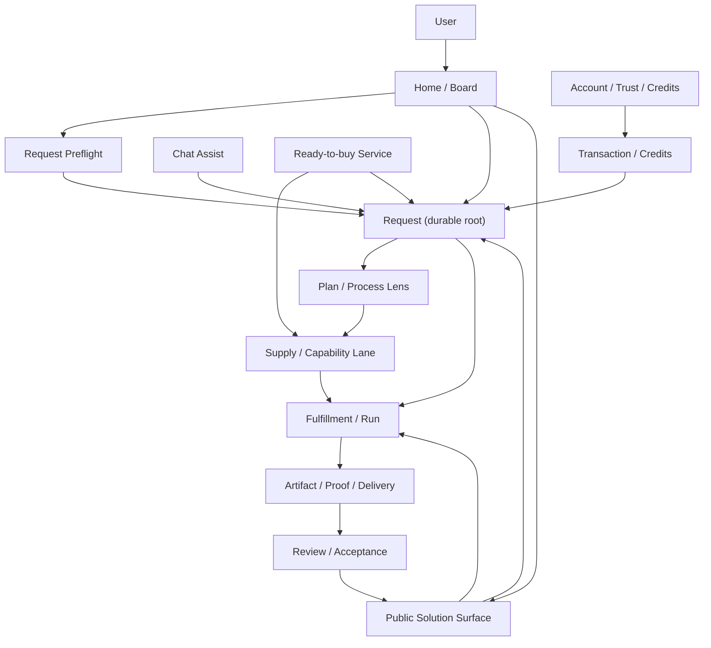
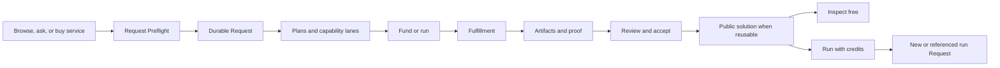

# Request Board And Workroom Revamp Blueprint

This blueprint guides a full Boreal web UX revamp.

It is downstream of canon.
It does not redefine `Request`, `Supply`, `Commitment`, `Fulfillment`, `Artifact`, `Transaction`, or `RequestEvent`.

Use it when frontend, UI/UX, product, or hero-copy workers need to make Boreal easier to understand and act on.

## Objective

Make Boreal immediately legible as a request-native work network.

The user should understand:

- post a request
- compare plans
- fund or run work
- track execution
- review artifacts and proof
- reuse accepted public solutions

The revamp should improve clarity and usability across the whole app.
It should not force one rigid layout before the worker has examined the current implementation and used appropriate UI/UX design methods.

## Design Posture

Design outcomes, not fixed components.

The target product reading is:

```text
Ask or browse
-> shape a Request
-> inspect Plans and capability lanes
-> fund or run execution
-> track Fulfillment
-> receive Artifacts and proof
-> review and accept
-> publish a reusable public solution when appropriate
-> inspect free or run again with credits
```

The product should feel like:

- Stack Overflow for request discovery and answer-like plan comparison
- a workroom for active execution
- a proof and artifact trail for delivery
- a credit-metered execution system for reruns

It should not feel like only:

- a chat app
- a marketplace listing grid
- a workflow builder
- a static documentation site
- a generic project tracker

## Canon Guardrails

Keep these rules visible during design:

- `Request` is the durable root object.
- `Supply` is a capability lane that can satisfy or support a request.
- `Commitment` carries commercial or approval terms.
- `Fulfillment` is execution truth.
- `FulfillmentStep` is sub-work inside one fulfillment.
- `Artifact` is output, proof, evidence, receipt, file, media, signature, or delivery.
- `Transaction` is payment and settlement truth.
- `RequestEvent` is the durable activity ledger.
- `Solution` is public UI language only, projected from completed requests and accepted artifacts.
- Public solutions are free to inspect by default.
- Running a solution consumes credits only when inference, workflow execution, provider APIs, human review, service capacity, or embodied fulfillment capacity is used.

## Product Knowledge Graph

Use this graph as a product north star, not as a replacement for schema docs.
If implementation needs a new API, state, event, or persistent field, update the canonical contracts first.



## End-To-End UX Flow



## Current Surface Effects

Every current surface should be examined before implementation.
The desired outcome is coherence across the app, not a single prescribed screen.

| Current surface | Current role | Revamp outcome |
| --- | --- | --- |
| Home page | Product explanation and entry CTAs | Becomes the clearest front door for demand, solved work, services, and request creation. Marketing copy becomes short contextual education, not the main burden. |
| Open requests | Public request discovery | Becomes the main request board, with search, status, age, plan count, run count, funding state, proof needs, and next action. |
| Request briefing | Request-mode intake and draft shaping | Becomes Request Preflight: captures ask, done condition, budget, deadline, constraints, proof, human work, local runtime, and embodied requirements without inventing fake structure. |
| Request object | Durable work thread | Remains the visible root. Every plan, run, artifact, transaction, review, and public solution should point back to it. |
| Chat | Intake and assistant lane | Stays useful for clarification and help. In opened requests, chat should become a supporting lane, not the entire workroom. |
| Flow UI | Request process projection | Must be preserved and improved as the process lens. It explains how a request gets done, but should not replace board discovery or workroom monitoring. |
| Tracking | Open request monitor | Becomes the workroom monitor: what is happening now, who owns it, what is blocked, what proof exists, and what action is next. |
| Right panel | Artifact or selected-context panel | Becomes contextual: selected flow node, proof package, artifact preview, run estimate, review state, route state, or next action. |
| Supply | Capability management | Becomes Supply Studio for capability lanes: what can be done, who or what fulfills it, how it runs, pricing, availability, and proof expectations. |
| Services | Buyer-facing packaged supply | Becomes ready-to-buy outcomes. Buying a service still creates or attaches to a request and delivers through fulfillment, artifacts, and transactions. |
| Account | Identity, security, and credits | Becomes trust and credits center: identity, passkeys, credit balance, ledger, request spending, and run readiness. |
| Delivery | Attached artifacts and fulfillment result | Becomes proof-first delivery. Completion should require accepted artifacts or explicit review, not merely generated output. |
| Public solutions | Target public projection over accepted work | Becomes the reusable knowledge surface. Inspecting is free. Running consumes credits only when live execution capacity is used. |

## System Sync Outcomes

The revamp must synchronize the visible UI with the actual system boundaries.

### Account

Account should become the user's trust and readiness center.
It should connect identity, passkeys, credits, ledger history, and run readiness.

Outcome:

- users know whether they can post, fund, run, review, or supply work
- credits are explained as execution prepay
- passkeys and account security feel connected to trusted request execution
- credit ledger rows remain explainable through request or top-up context

### Database And Contracts

The database should not be treated as a UI scratchpad.
The current durable objects already exist and should remain the basis for the revamp.

Outcome:

- UI projections read from canonical objects instead of inventing parallel state
- `Request.latest` and active refs provide summaries only
- full history stays in `RequestEvent`, `Artifact`, and `Transaction`
- if a new persisted projection is needed, canon and API contracts are updated first
- if a surface needs public-safe data, it uses an explicit public projection instead of leaking owner-only fields

### Request

Request remains the root of the experience.

Outcome:

- request pages are the canonical workrooms
- request cards are the canonical board items
- request status drives next action
- generated plans, runs, artifacts, reviews, and transactions are visibly attached to the request
- follow-up customization creates or references a new request when ownership, funding, route, or review boundaries change

### Chat

Chat remains useful but should not be the whole product.

Outcome:

- pre-request chat helps shape a request
- draft chat supports clarification and briefing
- opened-request chat supports assistance, comments, and guided actions
- durable progress comes from request objects and events, not from chat transcript alone
- generated text does not count as proof unless attached as an artifact with the right meaning

### Supply

Supply becomes understandable as a capability lane.

Outcome:

- buyers see supply as a route to get a request fulfilled
- providers see supply as what they can reliably do
- service pages can package supply, but still end in request-attached fulfillment
- supply status, availability, pricing, execution channel, and proof expectations are visible where they affect buyer decisions

### Services

Services should make paid outcomes easy without bypassing request truth.

Outcome:

- buyer starts from a clear package or preset plan
- checkout or credit use opens or references a request
- provider execution attaches fulfillment, artifacts, and transactions
- the request workroom remains the place where delivery is tracked and accepted

### Tracking

Tracking becomes the live monitor for request progress.

Outcome:

- users know the current state without reading the whole activity log
- blockers and retry paths are visible
- active fulfillment and worker state are visible when available
- review and acceptance actions are surfaced at the right time
- the ledger remains available, but not as the first thing every user must parse

### Right Panel

The right panel becomes selected context plus action.

Outcome:

- selecting a flow node updates the panel
- selecting an artifact previews the artifact and proof claims
- selecting a run explains credit use and output destination
- selecting review state explains what is accepted, missing, or disputed
- request-changing actions are explicit and state-aware

### Delivery

Delivery becomes proof-first.

Outcome:

- delivered state shows artifact, proof, fulfillment lane, and review need
- completed state shows acceptance truth
- media, files, documents, signatures, receipts, and evidence are treated as artifacts
- if proof is missing, the UI says what is missing instead of implying completion

### Public Solution

Public solution surfaces should make solved work reusable without becoming a new root object.

Outcome:

- every public solution links to a source request
- accepted artifacts and proof are visible
- inspection does not debit credits
- running or forking clearly creates or references a request
- rerun costs explain what capacity credits pay for

## Request Board Outcome

The request board should help users understand what is happening in the network.

It should make these questions easy:

- What requests are new?
- What requests are active?
- What requests are funded?
- What requests need plans?
- What requests need review?
- What requests are solved?
- Which solved requests can be reused?
- Which actions can I take now?

Workers may choose the best UI pattern, but the result should preserve:

- search first
- status filters
- visible age
- request title and short brief
- tags or fingerprints
- funding or grant state when implemented
- plan count
- run or fulfillment count when implemented
- proof or review requirement when relevant
- next action

## Request Workroom Outcome

An opened request should feel like a monitored workroom.

It should answer:

- What is this request?
- What is happening now?
- What plan or route is being followed?
- Which supply or worker lane is active?
- What is blocked?
- What proof is missing?
- What artifacts exist?
- What needs review?
- What action can the owner, solver, reviewer, or funder take?

The workroom should avoid making planner internals look like user-owned truth.
Derived planner fields can be shown as explanation, but the UI must keep buyer-authored brief, planner-derived structure, and execution truth distinct.

## Flow UI Outcome

The flow UI is valuable and should stay.

Its job is to show process shape:

```text
Request -> Plan -> Worker -> Delivery
```

For opened requests, it may show active phases, worker lanes, artifacts, review, and blocked states.
For drafts, it should show only real inferred structure and should remain visibly incomplete when the request lacks enough signal.

The flow should support:

- clicking a node to reveal the relevant context
- compact process comprehension
- clear status and blockers
- proof and delivery visibility
- a return path to the live next action

The flow should not become:

- a decorative node graph
- a fake task tree
- the only way to navigate
- a replacement for the request board
- a place where empty drafts invent execution structure

## Right Panel Outcome

The right panel should become a context and action surface.

It can show:

- selected flow node detail
- route and supply context
- artifact preview
- delivery package
- proof checklist
- review action
- run cost estimate
- credit explanation
- transaction receipt
- rerun or fork path

It should not become a generic dumping ground.
Artifact-local controls should remain minimal.
Request-changing actions should live in a request-aware action model.

Useful action families:

- `Route`
- `Work`
- `Proof`
- `Review`
- `Assist`
- `Run`
- `Fork`

## Services And Supply Outcome

Services and supply should read as two views of the same commercial machinery:

- Services are buyer-facing packaged outcomes.
- Supply is the capability object behind those outcomes.
- Starting a service should still create or attach to a request.
- Running a paid service or public solution should consume credits only for actual execution capacity.
- Delivered service outputs should land as artifacts inside the request thread.

Supply Studio should help providers and operators make capability lanes trustworthy.
It should emphasize:

- what gets done
- who or what fulfills it
- execution channel
- availability
- pricing
- proof expectations
- request fit

## Account And Credits Outcome

Account should support trust and paid execution clarity.

It should make these things obvious:

- who is signed in
- account security state
- passkey readiness
- credit balance
- pending top-ups
- ledger history
- request-level spending
- credits are execution prepay, not a broad wallet

Do not make credits feel like payment to read public knowledge.
Credits pay for runs, inference, provider calls, workflow execution, human review, or service capacity.

## Delivery And Proof Outcome

Delivery must read as proof-bearing work, not chat completion.

A delivered request should show:

- latest artifact
- artifact type
- proof claims
- missing proof, if any
- active fulfillment lane
- review or owner acceptance status
- transaction state when payment was involved

Do not call a request solved unless accepted artifact or accepted fulfillment truth supports that claim.

## Public Solution Outcome

A public solution is a reusable surface projected from a completed request.

It should show:

- source request
- accepted artifact
- proof or evidence
- solver attribution
- reviewer or requester acceptance
- safe request history
- whether it can be rerun
- what a rerun spends credits on
- fork path into a new request

Use this split everywhere:

```text
Inspecting is free.
Running consumes credits.
Customizing starts a new request.
```

## Navigation Outcome

Workers may choose the best navigation pattern, but the product should make these destinations legible:

- Home or Board
- Post Request
- Public Solutions
- Services
- Supply Studio
- Account and Credits
- Request Workroom

The current sidebar may evolve, but it should preserve the rule that one contextual list is shown at a time.
Avoid overloading the sidebar with every object type at once.

## Worker Brief

Use this prompt for UI/UX implementation workers:

```text
You are revamping Boreal web for maximum usability and clarity.

Start by examining the existing app surfaces: home, open requests, request mode, chat, request tracker, request flow canvas, activity timeline, artifact panel, services, supply studio, account credits, auth, and delivery.

Do not force a predetermined layout.
Choose the clearest design after inspecting the implementation.

Your goal is to make Boreal understandable as a request-native work network:
people post Requests, compare Plans, attach or buy Supply, fund or run Fulfillment, review Artifacts, and reuse accepted public solutions.

Keep Request as the visual and data root.
Every plan, run, supply, service, artifact, transaction, review, and public solution must point back to a Request.

Preserve and improve the flow UI as the process lens.
Use it to show how work moves from Request to Plan to Worker to Delivery.
Do not let it replace the board, workroom monitor, or proof review surfaces.

Make chat a helpful assist lane.
Do not make chat the whole product once a Request is open.

Show credits only where execution capacity is used.
Public solution inspection is free.
Paid actions should say what is being run and what credits pay for.

Before finishing, verify that a new user can understand:
Post a request, compare plans, run or fund work, verify output, and reuse accepted solutions.
```

## Acceptance Criteria

The revamp is on direction when:

- a new user understands the product in under ten seconds
- the homepage makes active demand, solved work, services, and request creation visible
- the request board is useful without reading marketing copy
- the request workroom shows current state, blocker, owner, proof, and next action
- chat is supportive but not dominant for opened requests
- the flow UI clarifies process without becoming decorative
- public solutions point back to accepted request and artifact truth
- public inspection is free by default
- paid runs explain credit use clearly
- services and supply still end in request-attached fulfillment and artifacts
- account credits are clearly tied to paid execution, not broad wallet behavior

## Implementation Discovery Checklist

Before changing screens, workers should inspect the current implementation and write down what each surface already supports.

Minimum surfaces to inspect:

- home and top navigation
- app sidebar and contextual lists
- open requests hub
- request mode and preflight briefing
- chat shell and active chat provider
- request plan panel
- request flow canvas
- request tracker
- request activity timeline
- artifact panel and artifact actions
- services hub and service checkout
- supply hub and supply editor
- account credits, top-up, and security pages
- request, supply, fulfillment, artifact, transaction, and buyer-credit API routes
- request, supply, payment, and database schema helpers

Workers should then propose the smallest coherent revamp slice that improves user comprehension without breaking request truth.

## Non-Goals

Do not:

- rename the canonical root object
- introduce `Solution` as a schema root
- imply passive funder revenue share
- imply tax-deductible donation status
- charge credits for reading public solutions
- claim live request-grant or public-solution marketplace behavior beyond implementation
- hide proof and review behind generic completion language
- replace the durable activity ledger with ephemeral chat state
